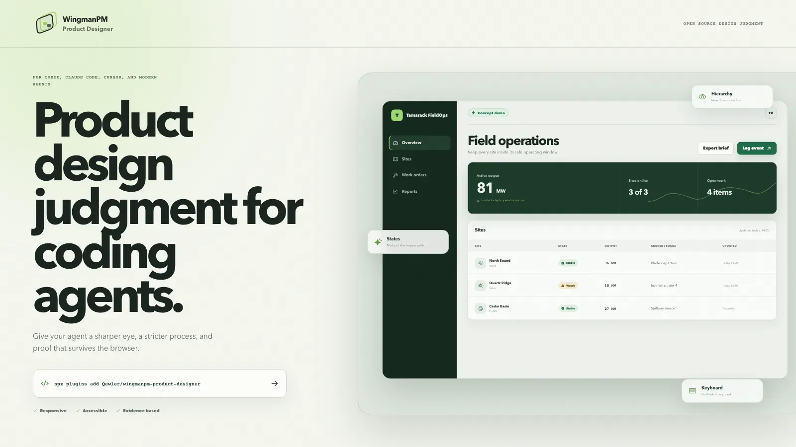
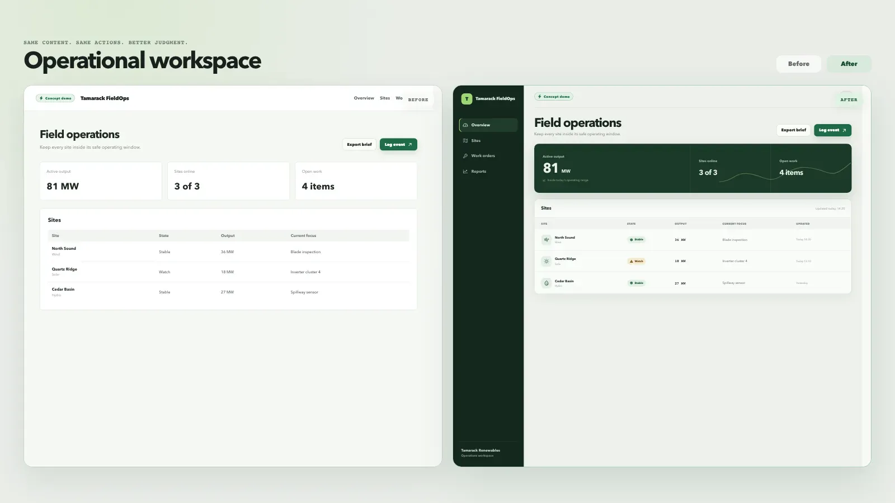
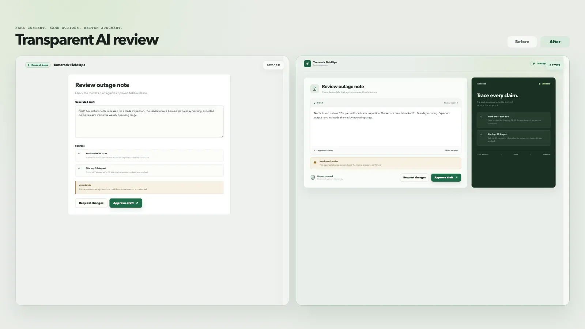
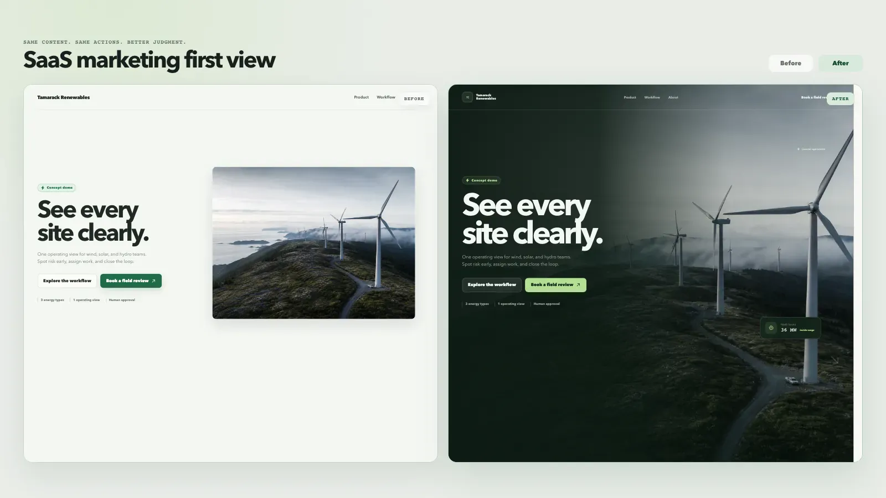
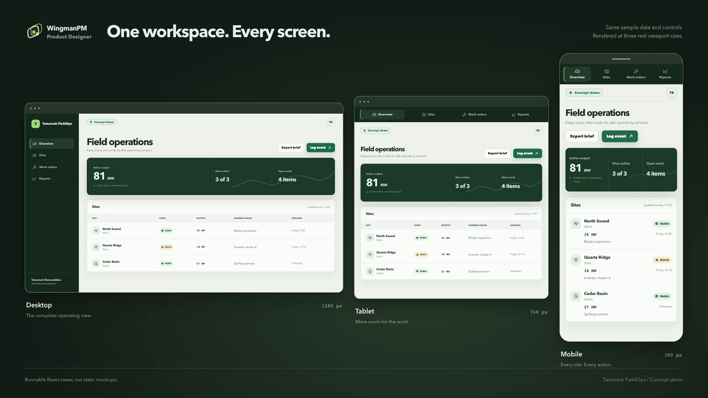

<p align="center">
  
</p>

<h1 align="center">Product design judgment for coding agents.</h1>

<p align="center">
  A portable design partner that reads the product, chooses the right level of change,
  ships the interface, and proves it in the browser.
</p>

<p align="center">
  <a href="https://www.npmjs.com/package/wingmanpm-product-designer"></a>
  <a href="https://github.com/Qewler/wingmanpm-product-designer/actions/workflows/ci.yml"></a>
  <a href="https://agentskills.io/specification"></a>
  <a href="LICENSE"></a>
  
</p>

<p align="center"><strong>Codex&nbsp;&nbsp; Claude Code&nbsp;&nbsp; Cursor&nbsp;&nbsp; Agent Skills</strong></p>

```bash
npx plugins add Qewler/wingmanpm-product-designer
```

<picture>
  <source media="(prefers-color-scheme: dark)" srcset="docs/assets/readme/hero-dark.webp">
  <source media="(prefers-color-scheme: light)" srcset="docs/assets/readme/hero-light.webp">
  
</picture>

## Proof, not promises

The showcase uses runnable React stories, the same copy and sample data on both sides, and deterministic Playwright captures. Every Tamarack Renewables surface is clearly marked **Concept demo**.

### Operational workspace

A usable first pass becomes a calm operating surface with clearer hierarchy, real status meaning, compact navigation, and less card noise.



### Transparent AI review

The same generated draft becomes reviewable. Sources, uncertainty, and the human approval boundary stay visible at the moment of action.



### SaaS marketing first view

The same promise, actions, and photograph move from a familiar split layout to a product-specific, atmospheric first view.



> **From the maker of WingmanPM**
>
> You fly the product. We cover your six. WingmanPM is an AI copilot for product managers that turns the chaos of customer feedback into organized, ranked, actionable decisions.
>
> [Explore WingmanPM](https://wingman.pm)

## One skill, several harnesses

Install through the interface your agent already understands.

| Target | Command |
| --- | --- |
| Agent Plugins | `npx plugins add Qewler/wingmanpm-product-designer` |
| Agent Skills | `npx skills add Qewler/wingmanpm-product-designer --skill wingmanpm-product-designer` |
| OpenAI Codex | `codex plugin add wingmanpm-product-designer@wingmanpm` |
| Claude Code | `claude plugin install wingmanpm-product-designer@wingmanpm` |
| npm / npx | `npx wingmanpm-product-designer@latest install --agent all` |

The skills.sh command installs the **complete skill folder**, including the
CLI, references, schemas, registries, and templates. The bundled CLI needs
Node.js 20 or newer and has no npm runtime dependencies. Do not install a raw
`SKILL.md` URL on its own.

Project setup is separate: `init` and `add data-table` declare the packages
their generated UI needs. The agent then installs those packages with the
project's package manager and installs Chromium when browser tests need it.
See [project setup](skills/wingmanpm-product-designer/references/setup.md).

Native marketplace installs need a one-time catalog setup:

```bash
codex plugin marketplace add Qewler/wingmanpm-product-designer
claude plugin marketplace add Qewler/wingmanpm-product-designer
```

Then ask for the outcome, not a pile of style tokens:

```text
# Codex
$wingmanpm-product-designer stunning onboarding

# Claude Code or Cursor
/wingmanpm-product-designer review billing settings

# Direct scope
$wingmanpm-product-designer standout the pricing page --level elevate
```

Plain requests work too. “Make this beautiful” inspects the product and applies a focused refinement. Use `explore` for visual alternatives, or `--level reimagine` for a replacement direction.

Claude marketplace installs namespace the explicit command as
`/wingmanpm-product-designer:wingmanpm-product-designer`. A standalone Agent
Skills install keeps the shorter `/wingmanpm-product-designer` form.

## Judgment before decoration

Most design prompts fail before the first pixel. They skip context, choose a fashionable default, and stop at one successful desktop state. This skill follows a scoped process:

1. **Inspect:** understand the product, stack, design system, information structure, and constraints.
2. **Explore when useful:** compare two polished directions using the same content, then save the user’s choice.
3. **Build:** implement product-owned components, useful motion, complete states, and explicit responsive behavior.
4. **Prove:** run focused build checks during iteration and the full browser and accessibility gate before shipping.

It covers product UI, marketing surfaces, design-system work, AI interactions, forms, navigation, account patterns, and operational tables. Existing capable components stay in place. Project truth wins over a generic aesthetic.

## Explore before you commit to a direction

```text
$wingmanpm-product-designer explore the AI review flow
```

The agent creates two polished local previews, a shared-content comparison board,
tradeoffs, and a recommendation. Desktop/mobile controls and full-size previews
make the differences visible. A served board saves your choice locally; a static
board prepares a chat message. The agent reads that decision before implementation.
No backend, image subscription, or other skill is required.

The bundled CLI adds `context`, `explore`, `proof`, and stage-aware `check` commands.
See [visual exploration](skills/wingmanpm-product-designer/references/explore.md)
and [scoped proof](skills/wingmanpm-product-designer/references/workflow.md).
A build check reports its scope and pending proof; it never certifies a release.

## Updates without repeated setup

The skill checks for new stable releases on first use, with a daily cache.
Clean standalone installs update automatically, with verified downloads and a
backup. Local edits and development checkouts stay intact. Native plugin installs
use the host's update channel; Cursor keeps its marketplace review boundary.
Read-only reviews check without writing. Use `update --disable` to pin a copy.
This starts after version 1.1 is installed; version 1.0 needs one normal installer
update first.
See [update behavior](skills/wingmanpm-product-designer/references/updates.md).

## Built for real product work

- **Existing products stay recognizable.** The skill reads routes, permissions, copy, data meaning, tokens, and shared components before it changes the surface.
- **New work gets a clear contract.** Product facts, visual direction, components, responsive rules, states, and proof live together instead of drifting across prompts.
- **Dense tools stay fast.** Tables, filters, bulk actions, inline edits, preferences, and keyboard paths are treated as workflows, not decorative grids.
- **AI stays under human control.** Drafts show scope, sources, uncertainty, progress, recovery, and the exact approval boundary before a consequential action.
- **Reviews stay honest.** `review` and `audit` are read-only unless a fix is requested. Findings separate measured defects from taste and name the proof still needed.
- **Handoffs are reproducible.** Managed files have hashes, user-owned files stay protected, browser evidence expires when sources change, and install state can be removed safely.

## The quality bar is executable

`npx wingmanpm-product-designer@latest check` blocks missing contracts and stale evidence. It checks token use, semantics, keyboard paths, loading and error states, responsive behavior, dark mode, reduced motion, AI approval boundaries, table behavior, and visual review freshness.

Card counts, raw colors, and motion patterns are review signals. Punctuation and repeated-heading checks are project policy. Machine-written browser evidence and explicit review still guard shipping.

```bash
npx wingmanpm-product-designer@latest init --project /path/to/project
npx wingmanpm-product-designer@latest check --project /path/to/project
npx wingmanpm-product-designer@latest doctor --project /path/to/project
```

Generated files are recorded in `.wingmanpm-design/manifest.json`. Upgrades refresh unchanged managed files and preserve project-owned work. Uninstall removes only unchanged managed files. `--dry-run` shows the plan before a write.

## Responsive by construction



The golden React path includes Storybook and Playwright proof. Other stacks receive the same design contract and portable references without pretending to be React.

## Trust is part of the design

- Apache-2.0 licensed, with no MCP server, account, secret, or plugin telemetry.
- The portable skill and OpenAI review archive contain no maker promotion.
- Normal agent output stays focused on the user's product. It does not inject WingmanPM mentions.
- The public maker story uses only public copy and assets. It includes no production data, private route, pricing, checkout, or sign-in.
- The showcase is repository proof and is excluded from the runtime package.

## Reproduce the visuals

Every image above comes from [`showcase/`](showcase/), not a painted screenshot.

```bash
npm --prefix showcase ci
npm --prefix showcase run build
npm --prefix showcase run capture
npm --prefix showcase run check
```

Read the [compatibility report](docs/compatibility.md), [publication record](docs/publication-record.md), [release notes](CHANGELOG.md), [security policy](SECURITY.md), or [support guide](SUPPORT.md). For all commands, run `npx wingmanpm-product-designer@latest --help`.

<p align="center">
  Built by <a href="https://github.com/Qewler">Julius / Qewler</a>. Released under <a href="LICENSE">Apache-2.0</a>.
</p>
