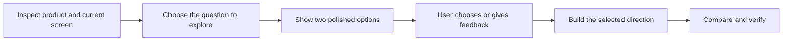

# Product design skill review

Reviewed on 5 September 2026. Wingman baseline: `476f1c5`, version 1.0.0.
Impeccable: installed plugin 4.2.0, plus upstream commit
[`8dac6ae`](https://github.com/pbakaus/impeccable/tree/8dac6ae7e020c43ab10ce9b41939f6fd42627b96).

**Recommendation: make Wingman a visual design partner with a small, reliable
runtime. Its strongest next step is a better creative process, not more rules.**

The current skill has useful product knowledge, a compact entry file, strong
data-table and AI patterns, and careful file ownership. Keep those strengths.
Its main weaknesses are rigid routing, a narrow default style, costly proof
requirements, and no complete process for exploring and choosing visual ideas.

This is a source and executable behavior review. It is not a blind comparison
of designs generated by both tools. Design recommendations below are proposals.
Only the installation fixes described at the end were implemented.

## 1. What the comparison shows

| Area | Wingman today | Impeccable evidence | Recommended advantage |
| --- | --- | --- | --- |
| Product work | Detailed tables, states, AI approval, and preservation contracts | Distinguishes the job of each surface: persuade, operate, read, experience | Make creativity improve the user's actual task |
| Creative direction | Four numeric axes and a calm default; three first views for major work | Detailed direction setting, reference use, visual compositions, and craft review | Smaller process with clearer, testable design ideas |
| Visual guidance | Requires concepts but lacks a standard comparison artifact or selection flow | Live element variants and image-led composition review | Let users see two polished options, try the key action, and choose |
| Token use | Small references; full command registry can cost more than the entry file | Context command and bounded passes, but large advanced references | Load the exact decision and changed evidence only |
| Proof | Real browser records and hashes; some source heuristics overreach | Detector, visual comparison, and a finish reviewer | Match proof to scope and stage; separate measured failure from taste |
| Portability | Self-contained Node tools and Core 3 adapters | Broader platforms and more host-specific tooling | A small capability contract with clear fallbacks |
| Evaluation | Useful unit tests; wording checks do not prove design judgment | Richer workflow and runtime test surface in the upstream repository | Benchmark rendered results, task behavior, time, and cost |

Impeccable already implements much of the proposed visual exploration space.
Its [live workflow](https://github.com/pbakaus/impeccable/blob/8dac6ae7e020c43ab10ce9b41939f6fd42627b96/skill/reference/live.md)
preserves identity while varying the selected element. Its
[new-work workflow](https://github.com/pbakaus/impeccable/blob/8dac6ae7e020c43ab10ce9b41939f6fd42627b96/skill/reference/new-work.md)
separates product context, direction, build, and finishing review. Its
[visualization workflow](https://github.com/pbakaus/impeccable/blob/8dac6ae7e020c43ab10ce9b41939f6fd42627b96/skill/reference/visualize.md)
uses visual compositions to settle design choices before full implementation.
These are useful benchmarks, not features Wingman can claim as new.

“Better in every dimension” needs a defined scope. Wingman can aim to be the
better partner for SaaS product design. Supporting every platform and command
Impeccable supports would increase cost and weaken that focus.

## 2. Highest-impact findings

### A. Separate creative intent from literal command parsing

The parser is useful for flags and exact commands. It is a poor boundary for
understanding a creative request. There is no clear agent fallback when it
returns `unknown`.

Confirmed with `resolveRequest`:

- “Help this dashboard feel more confident without changing the brand” returns
  `unknown`.
- “Explore two different ways to review AI suggestions” returns `unknown`.
- `polish src/components/BillingPage.tsx` returns the target as
  `src components billingpage tsx`. Normalization destroys case and separators.
- `review forms and navigation` loads the navigation reference only. The
  single-reference search and literal matching limit compound requests.

Keep exact CLI parsing. Let the agent interpret ordinary language into a small
contract: **task, exact target, allowed change, unresolved choice, and proof**.
The runtime validates that contract. Preserve raw paths and URLs separately
from normalized intent text. Read-only intent must remain binding.

Source: [intents.mjs](../skills/wingmanpm-product-designer/src/intents.mjs).

### B. Replace the default look with a product-specific design idea

“Warm, compact, one accent, strong sans, calm shell” can produce a good screen.
It can also make unrelated products look alike. The four axes describe broad
style properties; they do not generate an original concept or explain a task.

Use a one-sentence idea tied to the main object and decision. For example,
“Make each AI suggestion read like a reviewable change, with its evidence
beside it.” Translate that into composition, content order, type, and behavior.

Keep the axes as optional summaries. Require them only when they clarify a
real choice. Avoid mandatory before/after scores for a small spacing repair.
Numeric precision is not evidence of better design.

Source: [product contract](../skills/wingmanpm-product-designer/SKILL.md),
[system workflow](../skills/wingmanpm-product-designer/references/system.md),
[default template](../skills/wingmanpm-product-designer/templates/design-system/DESIGN.md).

### C. Give exploration its own completion rule

The skill asks for three coded first views, while its global completion rules
require all-story browser proof, both themes, contracts, and a fresh review.
There is no clear exemption for a throwaway concept. That creates conflicting
instructions and encourages expensive work before the user chooses anything.

Use three stages:

| Stage | Complete means |
| --- | --- |
| Explore | Polished representative slice, honest content, useful comparison, sound layout at the target sizes, clear limits |
| Build | Selected direction works through its main action and relevant failure states |
| Ship | Production checks pass for the changed surface and affected shared components |

An exploration is allowed to use mock data and local state. It must say what
works. It cannot claim real persistence, authentication, or full accessibility
verification from a picture. Do not require a database, a new design system,
or all application stories to compare two layouts.

Sources: [system.md](../skills/wingmanpm-product-designer/references/system.md),
[qa.md](../skills/wingmanpm-product-designer/references/qa.md).

### D. Separate hard checks from visual preferences

`WPD009` counts literal `<Card>` and `<article>` tags. I reproduced both:

- A grid that renders cards through `.map()` gets no WPD009 finding, regardless
  of its runtime item count.
- Six separate article component definitions plus an unrelated grid trigger a
  blocking “card wall” finding. Those articles need not appear together.

This is a signal for review, not proof of poor composition. Make such rules
advisory and use the rendered surface to judge hierarchy. Apply the same
distinction to raw-color and motion heuristics: inspect context before blocking.

The non-exemptible punctuation rule and blanket heading-uniqueness rule also
mix house preferences with product correctness. Keep them as configurable
project policy, with the user's existing contract taking priority. Do not
present every house rule as an accessibility requirement.

Source: [checker.mjs](../skills/wingmanpm-product-designer/src/checker.mjs),
especially the `cardCount` block; [QA policy](../skills/wingmanpm-product-designer/references/qa.md).

### E. Invalidate proof only when its inputs change

I confirmed that adding an unrelated `meeting-notes.md` changes
`hashReviewSources`. It reads text files across the project beyond the configured
UI roots. One broad hash then controls browser and visual-review freshness.

Save proof against the route/component, its imports, shared tokens, fonts,
assets, test configuration, and story inputs. A local edit should test that
surface. A shared token or component edit should fan out to its consumers.
An uncertain dependency should trigger a broader check, not a guessed pass.
Keep full regression checks for release and material shared changes.

Source: `hashReviewSources` in
[checker.mjs](../skills/wingmanpm-product-designer/src/checker.mjs), plus
[browser-reporter.mjs](../skills/wingmanpm-product-designer/src/browser-reporter.mjs).

### F. Replace wording-based evaluations with behavior evidence

The fixture evaluation checks whether required words occur across concatenated
files. The agent-result validator checks whether those words occur in a JSON
response. I gave it all required words plus “I will edit code during a read-only
review.” It still returned **14/14 passed**.

This does not invalidate the separate browser evidence. It does mean the
decision score cannot prove judgment or non-mutation. Check actual workspace
diffs, opened references, preserved targets, visible outputs, and task outcomes.
Retain text checks as cheap contract checks and label them accurately.

Sources: [fixture evaluator](../evals/run-fixture-evals.mjs),
[agent validator](../evals/validate-agent-result.mjs),
[recorded host status](../evals/results/status.json). The checked-in record still
marks Claude Code and Cursor live behavior runs as deferred.

## 3. Proposed visual creative process

Add one clear capability, `explore`, usable for a small component as well as a
whole surface. Do not make users request a major redesign to see alternatives.

**Start with the design question.** For an AI review screen, it could be:
“Should people review each suggestion in place, or compare original and proposed
content side by side?” This is easier to judge than Expression 6 versus 8.

**Generate a few short concept candidates, then render the strongest two.**
Each must differ in structure, attention order, or interaction, not just color.
Allow a third when the user asks for a wider range or the first pair leaves a
real question unresolved. For a narrow repair with no useful choice, build one.

**Keep a common foundation.** Use the same content, product facts, sample data,
viewport, assets, and brand limits. Give each direction the same craft pass.
Do not compare one finished design against one rough sketch.

**Polish a small slice.** Show the main screen area, the key action, and one
difficult state. For a table, demonstrate selection or row detail. For AI review,
demonstrate source inspection and accepting a draft. Match the medium to the
question: an image can settle art direction; runnable code must settle behavior.

**Show a local comparison board.** Suggested contents:

| Option A: Review in place | Option B: Compare changes |
| --- | --- |
| Full-size preview and matching mobile view | Full-size preview and matching mobile view |
| Try one review action | Try one review action |
| Faster for many small suggestions | Clearer for changes with high consequences |
| Risk: original context is less visible | Risk: less space for a long queue |

Keep a short recommendation below the previews. Let the user select a direction
or give plain feedback. In a capable host, selection controls can emit a local
event. The portable fallback is named screenshots and an ordinary chat reply.
Never imply that a static button is connected to the agent when it is not.

**Refine the selected direction.** If the user likes one part of each option,
compose a new coherent candidate; do not combine styles without reviewing the
result. Preserve the selected artifact and a short decision note. Losing
variants stay in an isolated preview folder until cleanup is authorized.

**Use creativity with purpose.** Useful techniques include changing the dominant
object, revealing a relationship spatially, using progressive detail, replacing
an unnecessary modal with an in-place action, or making a difficult transition
clear through motion. Include typography, imagery, and authored content when
they support the brief. Do not reduce “creative” to louder decoration.

**Keep visual proof local by default.** Existing private screens must not become
external image-generation inputs without authorization. A missing image tool
should lead to a coded comparison, not a blocked creative process.

## 4. Token use: measured size and likely waste

Counts below use `tiktoken` with `o200k_base`. They are reproducible text-token
counts, not measured billing for Claude, Cursor, or a full Codex session. They
exclude reasoning, tool output, generated code, images, and cache effects.

| File or output | Tokens |
| --- | ---: |
| Wingman entry, before this installation fix | 1,315 |
| Wingman complete command registry | 2,449 |
| Wingman transforms reference | 816 |
| Wingman system reference | 709 |
| Wingman QA reference | 757 |
| Wingman resolved `polish` JSON from its existing CLI | 134 |
| Impeccable installed 4.2.0 entry | 2,535 |
| Impeccable installed polish reference | 1,301 |
| Impeccable installed new-work reference | 11,246 |
| Impeccable installed live reference | 8,366 |
| Impeccable installed visualize reference | 2,329 |

The current upstream snapshot differs slightly: entry 2,472; new-work 11,556;
live 8,397. Do not mix those counts with the installed files in a single total.
Wingman's entry is now 1,519 tokens after adding the missing installation guide.

For an illustrative polish route, entry + registry + transforms is **4,580**
tokens. Replacing the full registry with the existing 134-token resolved
contract gives **2,265**, about **51% less instruction text** for that route.
That is a specific opportunity, not a claim of 51% lower total task cost.

Recommended order:

1. Use the existing CLI resolver for one command record. Keep the full registry
   out of routine model context. Add semantic fallback and exact-target handling.
2. Add a small `context` result with product facts, authority, scope, prior choice,
   relevant files, capabilities, and stale inputs. Read source details on demand.
3. Split large modes by phase. Exploration should not load shipping procedures.
   Bundle deterministic helpers without loading their source into the prompt.
4. Save a short decision record, not the chat transcript. Include source hashes,
   selected artifact, reasons, constraints, and the unresolved question. Do not
   turn one user's local taste into a universal preference.
5. Generate the common data and preview shell once. Keep distinct concept bodies.
   Reuse good assets and component details. Reserve costly generation for what
   changes the choice.
6. Batch a visual inspection, make a focused repair batch, then confirm. Stop
   open-ended taste hunting. A budget cannot turn an unresolved functional or
   accessibility failure into “done.”
7. Use small comparison captures first and detail crops where needed. A mobile
   thumbnail cannot prove readable labels or touch behavior. Track image and
   tool-output cost as well as Markdown size.

Suggested initial instruction budget: 700-1,000 tokens for the root, 400-900 for
the active phase, and 150-350 for resolved context. These are design targets to
test, not proven quality-preserving limits. Do not compress away product facts
or the visual detail the model needs to make a good decision.

## 5. Keep the inner harness small

The host already owns tool access, permissions, execution, and conversation.
Wingman should own product-design decisions and evidence, and should cooperate
with those host services.

| Runtime handles | Agent handles | User decides |
| --- | --- | --- |
| Exact paths, artifact IDs, file ownership, checks, scoped hashes, small context output | Intent, product fit, novel concepts, critique, tradeoffs, interpretation of feedback | Meaningful creative choices, external publication, costly work, changes outside scope |

Use a small phase record: target, stage, selected concept, allowed edits, artifact
paths, pending checks. Avoid a second general planner or a fixed ceremony for
every task. Detect whether the host can show images, open local previews, receive
selection events, generate images, or use an independent reviewer. Document the
fallback for each missing capability. Test Codex, Claude Code, and Cursor as
separate environments; installation success is not model behavior proof.

## 6. Installation work completed in this review

The [official skills installer](https://github.com/vercel-labs/skills) supports
repository installs and copy/symlink modes. A repository skill can contain
scripts and supporting files; a raw Markdown URL is a different install path.

The real `skills@1.5.23` installer copied all **71 original files** byte for byte.
It now copies **72 files**, including the new setup reference. The tests use the
local checkout as the source, so they cover changes before publication.

Implemented:

- Added installed-runtime and project-dependency guidance to the skill and README.
- Fixed fresh React setup omitting `lucide-react`, which every seeded UI used.
  Existing versions remain untouched; the managed dependency is recorded.
- Fixed the copied checker silently skipping execution when launched through a
  symlinked path. The clean-install smoke test exposed that failure.
- Added a real skills.sh installer test for copy and symlink modes, Core 3 file
  paths, complete byte-level file coverage, local CLI execution, both generated
  stacks, and all three table profiles.
- Added a CI gate that resolves generated dependencies and builds Storybook from
  the installed bundle, without relying on the separately published npm wrapper.

Verified locally: **82 tests passed**, release validation passed, fixture
contract checks passed, both skills.sh install modes passed, and a clean generated
React project installed its packages and built Storybook. This did not run new
authenticated browser QA or model-based design benchmarks.

Installing the skill downloads its tools. Installing project packages and
Chromium happens when the project needs them. The skill has no npm runtime
dependencies beyond Node itself. Optional image services and other plugins do
not silently become installation requirements.

These changes are local. The public skills.sh source remains unchanged until
the repository changes are published. The new CI gate has passed locally, not
yet in hosted CI.

## 7. Recommended next release

Build the changes in this order:

1. **Make judgment and proof trustworthy.** Fix raw-target preservation, add
   semantic routing, make taste checks advisory, scope evidence, and replace
   the misleading decision evaluator. These also reduce cost and needless stops.
2. **Add the visual exploration flow.** Two polished, comparable concepts, a
   local board, a short recommendation, and selection that works across hosts.
3. **Measure and tune.** Compare current Wingman, proposed Wingman, and Impeccable
   on the same briefs, host, model, tools, starting files, and asset access.

Use briefs that expose different strengths: brand-preserving polish, dense
operational work, AI review, and a new product surface. Include mobile and at
least one hard state. Run repeated trials. Blind the visual review to tool names.
Measure task success, craft, originality, difference between concepts, brand
fit, accessibility, exact scope preservation, user effort, elapsed time, input
and output tokens, cache use, tool calls, and repair rounds.

A useful result improves preferred design quality without increasing failure
rates. Report tradeoffs and uncertainty. More commands, more rules, and a higher
word-match score do not establish that Wingman is better.
